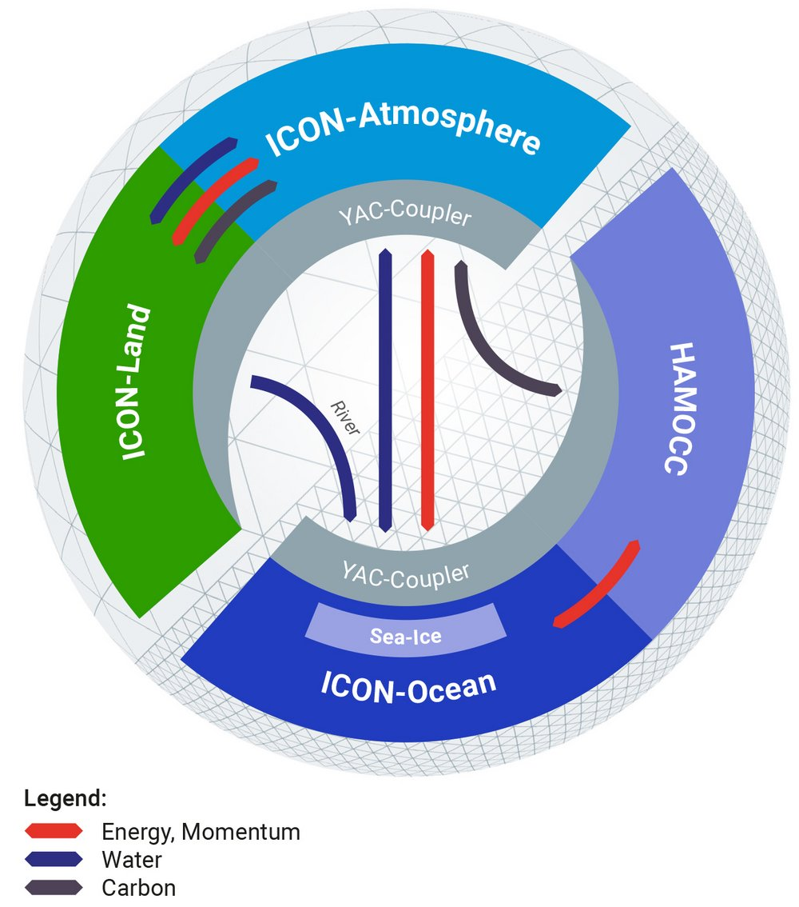

# ICON

Code Ownership of the   Upper Atmosphere Components of the  
Icosahedral Nonhydrostatic (ICON) Model

## Overview

:::: {.columns}

::: {.column width=50%}

:::

::: {.column width=50% .incremental}
- Unified global weather prediction and climate model co-developed by German Weather Service, MeteoSwiss, etc.
- Massively parallel with MPI, OpenMP, and OpenACC offloading 
- Operational at DWD since 2015 for weather forecasting in Germany and Switzerland
:::

::::

## Contributions

::: {.incremental}
- Refactored 10k+ LOC in upper-atmosphere components into modular structure, enabling GPU porting and separation of responsibilities
- Integrated FTorch (Fortran-PyTorch) into the ICON build system
- Leading adoption of Enzyme for automatic differentiation and modernizing compiler infrastructure at DKRZ
::: 

## Relevance {.smaller}

::: {.incremental}
- **Large-scale refactoring** (10k+ LOC) demonstrates ability to navigate and improve complex, multi-author Fortran codebases — directly relevant to DPPS common software development
- **Build system integration & compiler modernization** mirrors the multi-toolchain integration and verification work required by DPPS
- **Handling scientific merge requests** across institutions mirrors the distributed, collaborative review process described in the role
- **Scale**: 550k `Fortran` (10k Upper Atmosphere), 3k `m4` (GNU Autotools) LOC
::: 
