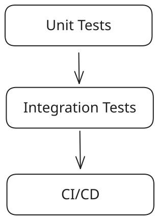

# LinguaLoop

A Modular, Tested, and Packaged Language Learning App

## Overview {.smaller}

:::: {.columns}

::: {.column width=50%}

:::

::: {.column width=50%}


::: {.incremental}
- Motivation
    - Practice language listening skills
    - Small segment of YouTube video
    - Your transcript vs reference
:::

::: {.incremental}
- Technology
    - [GitHub: lingua-loop](https://github.com/jfdev001/lingua-loop)
    - Python (FastAPI)
    - CI/CD (GitHub Actions)
    - Automated Testing (Pytest)
    - [Public Documentation](https://jfdev001.github.io/lingua-loop/)
    - [PyPI: lingua-loop](https://pypi.org/project/lingua-loop/)
:::

::: {.fragment}
```shell
docker run -p 49152:49152 lingua-loop
```
::: 
:::


::::


## System Architecture {.smaller}


:::: {.columns} 
::: {.column width=50%}

:::

::: {.column width=50%}

::: {.fragment}
- API/Web Layer
    - Handle client HTTP requests
    - Handle web server responses
:::

::: {.fragment}
- Business Logic/Services Layer
    - Parse and normalize user input
    - Compute scoring metrics for transcription attempt
:::

::: {.fragment}
- Data Layer
    - Use "boundary" (aka integrations) to scrape reference YouTube transcripts
    - Read/write to SQLite database
:::

:::
::::


## Testing Strategy {.smaller}

:::: {.columns}

::: {.column width=50%}

{width=200}

::: {.fragment}
```
tests/
├── boundary/
│   └── test_youtube_transcript_api.py
├── integration/
│   └── test_integration.py
└── unit/
    ├── api/
    ├── db/
    └── services/
```
:::

:::

::: {.column width=50% .incremental}
- Multi-layer testing
- Extensive use of mocking to isolate dependencies (DB, services, external APIs)
- Unit tests validate service logic in complete isolation
- Integration tests run full stack: API → service → database (no mocks)
- CI/CD on GitHub enforces all tests pass during PR
:::

::::


## From Code to Package

:::: {.columns}

::: {.column width=50%}
{height=500}
:::

::: {.column width=50%}
{height=500}
:::

::::

## Relevance


::: {.incremental}
- Mocks emulate subsystem behavior for isolated validation
- Integration tests verify interactions across components
- CI pipelines provide automated validation
- Full-stack, start to finish, independent, and no vibe coding
- Scale (LOC): 1k `Python`, 500 `JavaScript`
:::
