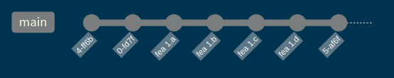
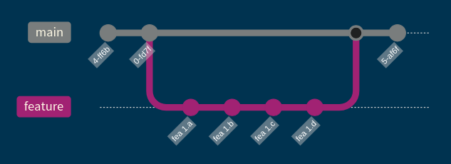
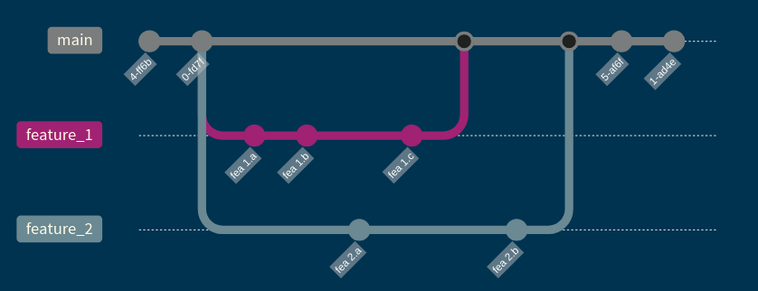

# Intro to GitHub

## What is GitHub

:::: {.columns}
::: {.column .incremental width=45%}
- Stores Git repositories online
- Helps developers collaborate on code
- Provides tools for project management
:::

::: {.column width=5%}
:::

::: {.column .fragment width=45%}
{width=10in height=4in}
:::
::::

## Issues

- Creating issues can be useful for keeping track of work.
- Subsequent commits (in pull requests, more on this later) can reference a particular issue(s).
- Generally you open issues in main repository, but opening them in your fork is fine.

## Exercise 

- What sort of improvements could you think of adding to the `miniweather` simulation?
- Open an issue in either your fork or in my repository if you don't have a fork!
- Hints:
    - Different spatial discretization schemes?
    - CUDA implementation?
    - Different governing equations?

## Branches {.smaller}

:::: {.columns}
::: {.column width=45%}
::: {.fragment}
- We have only used the `main` branch for all commits.

:::

::: {.fragment} 
- A more standard approach is to create a branch dedicated to a particular feature or set of changes, then you merge back into main when completed.

:::
:::

::: {.column width=5%}
:::

::: {.column width=45%}
::: {.fragment}
- `git branch <branch name>`
    - Create new branch from current branch.
:::

::: {.fragment}
- `git checkout <branch name>`
    - Move to different branch.
:::

::: {.fragment}
- `git merge <branch name>`
    - Tie the target branch back into the *current* branch.
    - e.g., `git merge feature`
:::
:::
::::

## Branches

Branches facilitate concurrent feature development and project organization.

## Exercise {.smaller}

:::: {.columns}
::: {.column width=45%}
- We want to add a script that cleans/deletes the `build_output` directory.
- Create a branch and add a script (Bash, Python, etc.) to `miniweather/build/`
called `clean_build_output` that does this for us.
- Make sure to `git add` and then `commit` your changes.
- `push` your new branch to your remote repository.
- Switch back the `main` branch and inspect the `git log` and `git branch`s.
:::

::: {.column width=5%}
:::

::: {.column width=45%}
- `git branch [<branch name>]`
- `git checkout <branch name>`
- `git add`
- `git commit`
- `git push -u origin <new branch name>`
:::
::::

## Pull Requests

::: {.incremental}
- A graphical way to merge branches into `main` on GitHub.
- Can be linked back to GitHub issues, thus improving development organization.
- Method of tracking progress (open a PR after first push) and discussion.
- Should include description of <ins>what</ins> you've done and <ins>why</ins> you did it.
::: 

## Exercise 

From branch(es) you pushed in the previous exercise open a pull request to either:

- The `main` branch of my repository.
- The `main` branch of your fork.

Then try and merge what you've done.

If there are `merge conflicts` try to resolve them.

## Git Workflow: The Finale


