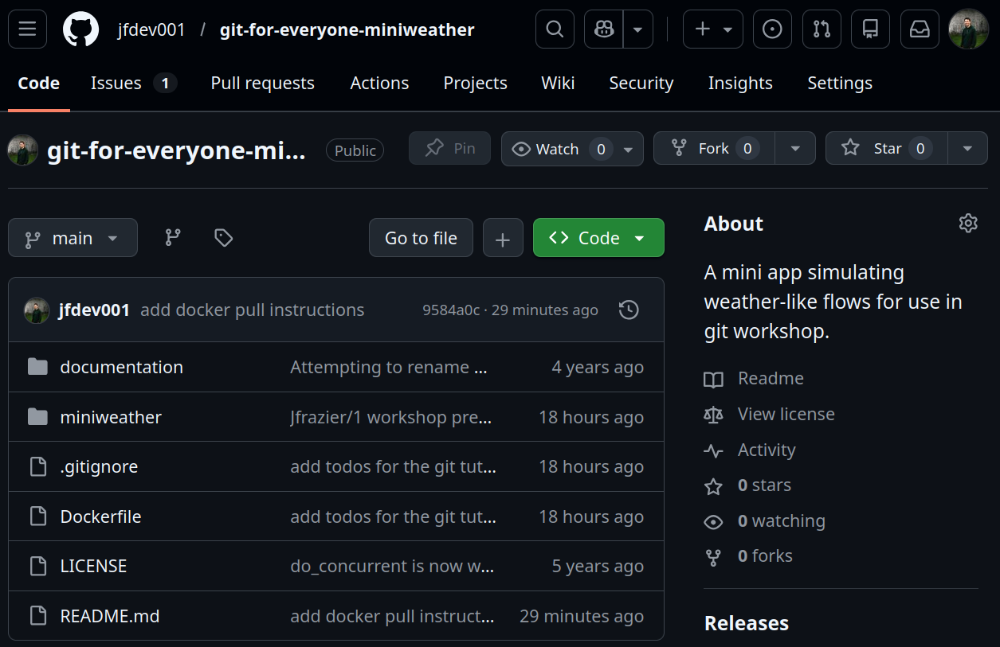

## Precursors

#### Slides

<!-- TODO: QR codes here would be really cool -->
<!-- TODO: change local host here... -->

- Go to the slides since there are lots of clickable links:
\
[jfdev001.github.io/talks/git-for-everyone/index.html](http://localhost:4000/talks/git-for-everyone/)

#### Hands-On Materials

- We'll use this repository for the exercises:
\
[github.com/jfdev001/git-for-everyone-miniweather](https://github.com/jfdev001/git-for-everyone-miniweather)

#### Behavior

- Ask questions whenever they arise!
- I will make mistakes, though I'll try my best not to.

## Structure

#### Objectives 

::: {.incremental}
- Motivate version control and code collaboration tools.
- Introduce the basic `git` commands (mental models).
- Relate `git` + GitHub (branches, issues, pull requests, etc.).
- Cover Intermediate `git` + GitHub (merge, rebase, etc.).
:::

#### Style

::: {.incremental}
- Mix teaching and practical exercises.
- Ideally, you should have a computer with a text editor/IDE, terminal, and browser open.
:::

## Setup {.smaller}
### Git 

#### Windows
- If you are on Windows, select one of the standalone installers (most likely x64)
from [install on Windows](https://git-scm.com/install/mac).


#### Linux + macOS
- In a terminal, check that `which git` returns a path, otherwise see
    [install on Linux](https://git-scm.com/install/linux) or [install on
    macOS](https://git-scm.com/install/mac), respectively.

### GitHub
- If you don't already have an account, go to [Sign up for GitHub](https://github.com/signup) and go to [Appendix: SSH Keys with GitHub](#ssh-keys-with-github) if you want to be able to `push` to your repositories.
- Go to the workshop repository and star/`fork` (top right corner) it: \
[github.com/jfdev001/git-for-everyone-miniweather](https://github.com/jfdev001/git-for-everyone-miniweather)

## TODO Planning Practical Exercises {.smaller}

* Add requirements.txt for the matplotlib dependency
* Tell the user how to build and test using the cmake test script
* Add a documentation at the top of the docker file to tell
what it is 
* If you know that pnetcdf is a dependency, do you need to worry
about potentially large files being generated in the repo? .gitignore
would be nice here...
* there's a script described in the readme that has other dependencies... what about those? can that be moved into an actual scrit??
* i need to force a merge conflict 

# Intro to Git

## What is Git

::: {.incremental}
- A version control system developed by Linus Torvalds (creator of Linux).
- Record the history of file changes over time.
- For each revision/snapshot (aka commit) tell:
\
<ins><b>Who</b></ins> changed <ins><b>what</b></ins>, <ins><b>when</b></ins>,
and <ins><b>why</b></ins>.
- Intended for text files and <ins><b>small</b></ins> datasets (<100 MB).
- Fundamentally <ins><b>not</b></ins> for large file storage, see [git-lfs](https://git-lfs.com/), [dvc](https://git-lfs.com/), etc instead.
:::

## Why You Should Use Git {.smaller}

:::: {.columns}
::: {.fragment .column width=50%}
](images/phd_version_control.gif){fig-align="left" width=10in height=6in}
:::

::: {.fragment .column width=50%}
- Wednesday 22 Jan 2026 11:45 `viz_my_data.py`
- Thursday  23 Jan 2026 14:23 `viz_my_data_v1.py`
- Friday    24 Jan 2026 23:45 `viz_my_data_final_v2_stable.py`
:::
::::

## Git Workflow: A Primer

).](images/git_overview.png)

## Basic Commands 

- `git init`
- `git clone`
- `git status`
- `git log`
- `git add` 
- `git commit` 

## Git Workflow: Revisited

).](images/git_overview.png)

## A Warning


# Intro to GitHub

## What is GitHub

:::: {.columns}
::: {.column .incremental width=45%}
- Stores Git repositories online
- Helps developers collaborate on code
- Provides tools for project management
:::

::: {.column width=5%}
:::

::: {.column .fragment width=45%}
{width=10in height=4in}
:::
::::

## Thanks!

:::: {.columns}
::: {.column width="20%"}
Get in touch:
:::

::: {.column width="5%"}
:::

::: {.column width="75%"}
 \ Jared Frazier 

 \ [jfdev001](https://github.com/jfdev001)

 \ [jfdev001.github.io](https://jfdev001.github.io/)

 \ [jared-frazier-797590188](https://www.linkedin.com/in/jared-frazier-797590188/)

 \ [jaredfrazierapplications@gmail.com](mailto:jaredfrazierapplications@gmail.com)


:::
::::

# Appendix 

## SSH Keys with GitHub 

- Todo put instructions here 

::: {.panel-tabset}


### Windows cmd.exe

```default
C:\> python -m venv rse-venv
C:\> rse-venv\Scripts\activate.bat
(rse-venv) C:\> pip install <packagename>
(rse-venv) C:\> deactivate
C:\>
```

### Linux/macOS

```default
$ python3 -m venv rse-venv
$ source rse-venv/bin/activate
(rse-venv) $ pip install <packagename>
(rse-venv) $ deactivate
$

```

:::
