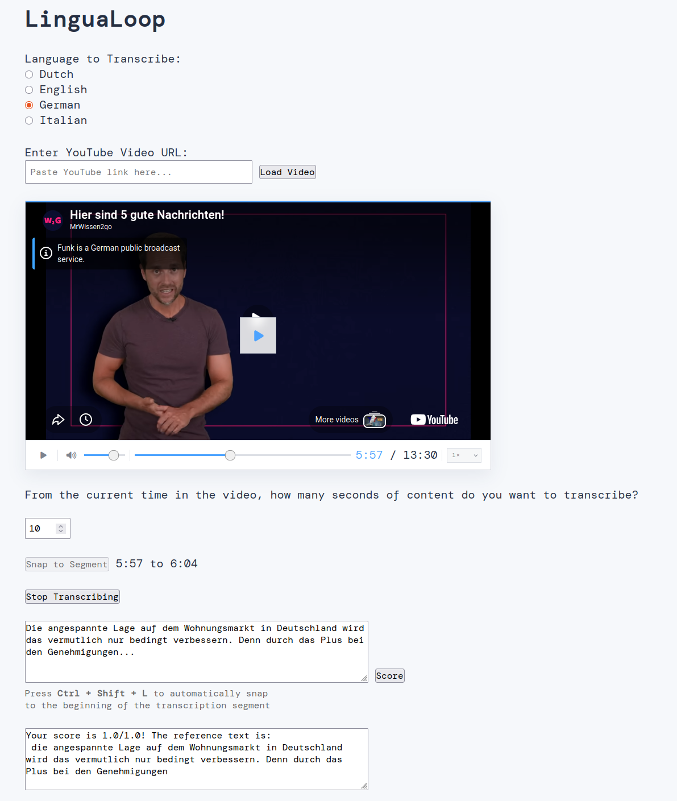
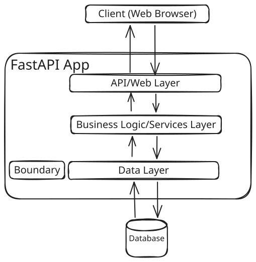
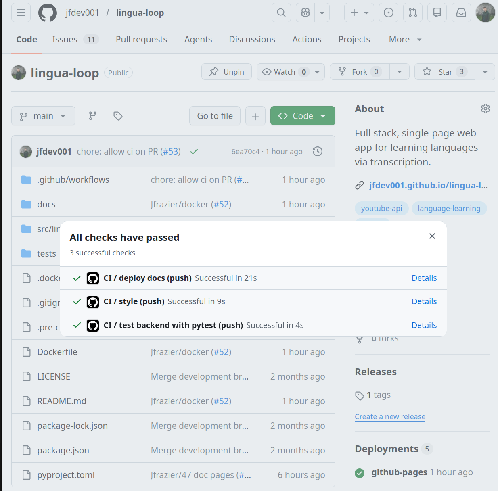
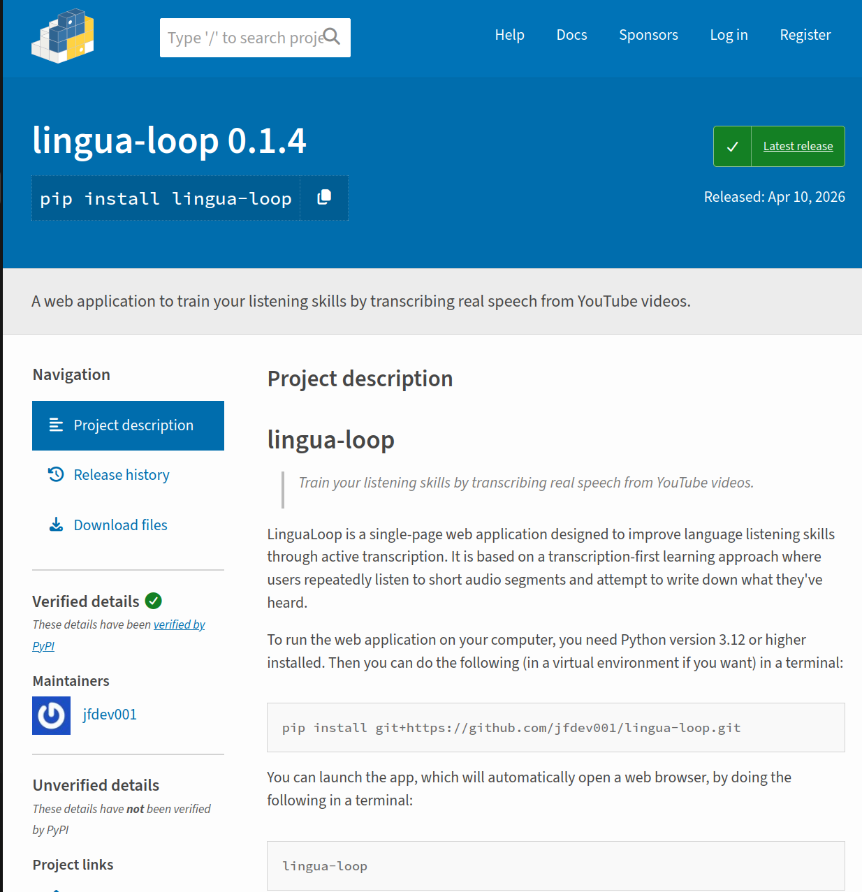

## Overview

:::: {.columns}

::: {.column width=50%}

:::

::: {.column width=50% .incremental}
- [GitHub: lingua-loop](https://github.com/jfdev001/lingua-loop)
- Python (FastAPI)
- CI/CD (GitHub Actions)
- Automated Testing (Pytest)
- [Public Documentation](https://jfdev001.github.io/lingua-loop/)
- [PyPI: lingua-loop](https://pypi.org/project/lingua-loop/)

::: {.fragment}
```shell
docker run -p 49152:49152 lingua-loop
```
::: 
:::


::::


## System Architecture {.smaller}


:::: {.columns} 
::: {.column width=50%}

:::

::: {.column width=50%}

::: {.fragment}
- API/Web Layer
    - Handle client HTTP requests
    - Handle web server responses
:::

::: {.fragment}
- Business Logic/Services Layer
    - Parse and normalize user input
    - Compute scoring metrics for transcription attempt
:::

::: {.fragment}
- Data Layer
    - Use "boundary" (aka integrations) to scrape reference YouTube transcripts
    - Read/write to SQLite database
:::

:::
::::


## Testing Strategy {.smaller}

:::: {.columns}

::: {.column width=50%}

{width=200}

::: {.fragment}
```
tests/
├── boundary/
│   └── test_youtube_transcript_api.py
├── integration/
│   └── test_integration.py
└── unit/
    ├── api/
    ├── db/
    └── services/
```
:::

:::

::: {.column width=50% .incremental}
- Multi-layer testing
- Extensive use of mocking to isolate dependencies (DB, services, external APIs)
- Unit tests validate service logic in complete isolation
- Integration tests run full stack: API → service → database (no mocks)
- CI/CD on GitHub enforces all tests pass during PR
:::

::::


## Reproducible Engineering

:::: {.columns}

::: {.column width=50%}
{height=500}
:::

::: {.column width=50%}
{height=500}
:::

::::

## Relevance {.smaller}

:::: {.columns}

| Satellite Subsystem            | Verification Goal                                      | LinguaLoop Equivalent                                  |
|----------------------------------|--------------------------------------------------------|--------------------------------------------------------|
| Communications                   | Reliable communication between subsystems             | API endpoints and client-server communication          |
| Payload                          | Correct processing of mission data                    | Language processing and business logic                 |
| Command & Data Handling          | Commands executed correctly and state managed         | Backend services, database interactions, and state     |

---

::: {.incremental}
- Mocks emulate subsystem behavior for isolated validation
- Integration tests verify interactions across components
- CI pipelines provide automated validation
- LinguaLoop is small, see [my other open-source contributions (Python, Fortran, C, Julia)](https://jfdev001.github.io/cv#foss) and [work contributions to codebase with 500k+ lines of code](https://gitlab.dkrz.de/icon/icon-model/-/commit/74e0f9997f96270a30f1a36d34302051f0c71696)
:::

::::

# Thanks!

:::: {.columns}
::: {.column width="20%"}
Get in touch:
:::

::: {.column width="5%"}
:::

::: {.column width="75%"}
<!-- TODO: commented out to avoid querying google api (reduce bandwidth) -->
 \ Jared Frazier 

 \ [jfdev001](https://github.com/jfdev001)

 \ [jfdev001.github.io](https://jfdev001.github.io/)

 \ [jared-frazier-797590188](https://www.linkedin.com/in/jared-frazier-797590188/)

 \ [jaredfrazierapplications@gmail.com](mailto:jaredfrazierapplications@gmail.com)

:::
::::

# References

- Yeman, R., & Malaliya, Y. (2025). *Accelerating Satellite Development: A Comparative Simulation of NASA's Waterfall Process and Agile Process Using Innoslate Lifecycling Modeling Language*. Naval Postgraduate School. [pdf](https://dair.nps.edu/bitstream/123456789/5373/1/SYM-AM-25-336.pdf).
